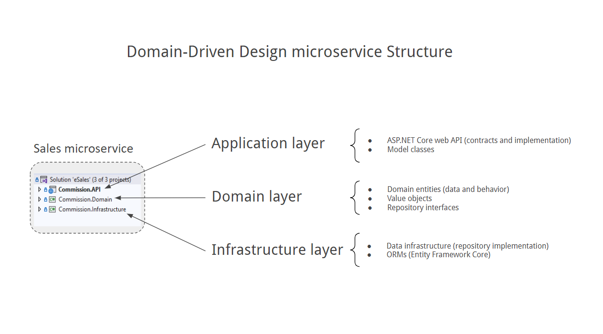

# ServiceAPI
ASP.NET Web API

## Disclaimer

I do not claim that this design is in anyway better or cleaner than any others out there. This is simply what worked very well for me in several of my projects. Most software developers out there recognize that there is no single architecture which is best. The best architecture is the one that works well for you, your team and your type of project. This is by no means a production-ready solution, it is not a framework, it is merely a starting point.

Furthermore, this solution is not by all means complete in terms of features. There are several features which can be beneficial depending on the type of project you are building (caching, analytics etc.) which are not included at the time of this writing, but can be easily added if needed. I try to maintain this and add new features as much as time permits, so if you have any suggestions feel free to ask or contribute.

## Minimal API with ASP.NET Core

Minimal APIs are architected to create HTTP APIs with minimal dependencies.

https://learn.microsoft.com/en-us/aspnet/core/tutorials/min-web-api


## Web API with ASP.NET Core

Building a controller-based web API that uses a database.

https://learn.microsoft.com/en-us/aspnet/core/tutorials/first-web-api


## Entity Framework Core

Create a new project

```bash
dotnet new console -o EFGetStarted --framework net8.0
cd EFGetStarted
dotnet add package Microsoft.EntityFrameworkCore.Sqlite
```

Create the database

```bash
mkdir Database
dotnet tool install --global dotnet-ef
dotnet add package Microsoft.EntityFrameworkCore.Design
dotnet ef migrations add InitialCreate
dotnet ef database update
```

Run the app

```bash
dotnet run
```


## Domain-Driven Design in ASP.NET Core

This ASP.NET Core solution is built following the principles of Domain-Driven Design (DDD). It is structured into three main layers: `Domain`, `Application`, and `Infrastructure`.

### Layers in a DDD Microservice Project

Layering is commonly used in medium and large applications with significant business model complexity. Structuring software into layers helps developers manage this complexity, facilitating maintenance, evolution and separation of responsibilities. The most commonly used layers include:

- **Domain layer** – Contains the core business logic and domain rules, independent of technical details.
- **Application layer** – Orchestrates operations and coordinates interactions between the presentation and domain layers without including business logic.
- **Infrastructure layer** – Implements technical details such as data persistence, communication with other services, and external integrations.



To create the application, use the following commands:

```bash
mkdir ServiceAPIDDD
cd ServiceAPIDDD
dotnet new sln -n ServiceAPIDDD

dotnet new classlib -n ServiceAPI.Domain --framework net8.0
dotnet sln add ServiceAPI.Domain/ServiceAPI.Domain.csproj

dotnet new classlib -n ServiceAPI.Infrastructure --framework net8.0
dotnet sln add ServiceAPI.Infrastructure/ServiceAPI.Infrastructure.csproj

dotnet new webapi -n ServiceAPI.API --framework net8.0
dotnet sln add ServiceAPI.API/ServiceAPI.API.csproj
cd ServiceAPI.API
dotnet add reference ../ServiceAPI.Domain/ServiceAPI.Domain.csproj
dotnet add reference ../ServiceAPI.Infrastructure/ServiceAPI.Infrastructure.csproj
```

https://www.telerik.com/blogs/getting-started-domain-driven-design-aspnet-core


## ASP.NET Core SignalR

Create real-time web app
https://learn.microsoft.com/en-us/aspnet/core/tutorials/signalr?view=aspnetcore-9.0&tabs=visual-studio

### ASP.NET SignalR vs ASP.NET Core SignalR

|                      | ASP.NET SignalR | ASP.NET Core SignalR |
| -------------------- | --------------- | -------------------- |
| **Server NuGet package** | [Microsoft.AspNet.SignalR](https://www.nuget.org/packages/Microsoft.AspNet.SignalR/) | None. Included in the [Microsoft.AspNetCore.App](xref:fundamentals/metapackage-app) shared framework. |
| **Client NuGet packages** | [Microsoft.AspNet.SignalR.Client](https://www.nuget.org/packages/Microsoft.AspNet.SignalR.Client/)<br>[Microsoft.AspNet.SignalR.JS](https://www.nuget.org/packages/Microsoft.AspNet.SignalR.JS/) | [Microsoft.AspNetCore.SignalR.Client](https://www.nuget.org/packages/Microsoft.AspNetCore.SignalR.Client/) |
| **JavaScript client npm package** | [signalr](https://www.npmjs.com/package/signalr) | [`@microsoft/signalr`](https://www.npmjs.com/package/@microsoft/signalr) |
| **Java client** | [GitHub Repository](https://github.com/SignalR/java-client) (deprecated)  | Maven package [com.microsoft.signalr](https://search.maven.org/artifact/com.microsoft.signalr/signalr) |
| **Server app type** | ASP.NET (System.Web) or OWIN Self-Host | ASP.NET Core |
| **Supported server platforms** | .NET Framework 4.5 or later | .NET Core 3.0 or later |

https://learn.microsoft.com/en-us/aspnet/core/signalr/version-differences?view=aspnetcore-9.0


## Default endpoint

New ASP.NET Core projects are configured to bind to a random HTTP port between 5000-5300 and a random HTTPS port between 7000-7300. The selected ports are stored in the generated Properties/launchSettings.json file and can be modified by the developer. The launchSetting.json file is only used in local development.

If there's no endpoint configuration, then Kestrel binds to http://localhost:5000.

## Configure endpoints

Kestrel endpoints listen for incoming connections. When an endpoint is created, it must be configured with the address it will listen to. Usually, this is a TCP address and port number.

There are several options for configuring endpoints:
- Configure endpoints with URLs
- Specify ports only
- Configure endpoints in appsettings.json
- Configure endpoints in code

### Configure endpoints with URLs

The following sections explain how to configure endpoints using the:

- `ASPNETCORE_URLS` environment variable.
- `--urls` command-line argument.
- `urls` host configuration key.
- `UseUrls` extension method.
- `WebApplication.Urls` property.

### Specify ports only

Apps and containers are often given only a port to listen on, like port 80, without additional constraints like host or path. HTTP_PORTS and HTTPS_PORTS are config keys that specify the listening ports for the Kestrel and HTTP.sys servers. These keys may be specified as environment variables defined with the `DOTNET_` or `ASPNETCORE_` prefixes, or specified directly through any other config input, such as `appsettings.json`. Each is a semicolon-delimited list of port values, as shown in the following example:

```
ASPNETCORE_HTTP_PORTS=80;8080
ASPNETCORE_HTTPS_PORTS=443;8081
```

The preceding example is shorthand for the following configuration, which specifies the scheme (HTTP or HTTPS) and any host or IP.

```
ASPNETCORE_URLS=http://*:80/;http://*:8080/;https://*:443/;https://*:8081/
```

The HTTP_PORTS and HTTPS_PORTS configuration keys are lower priority and are overridden by URLS or values provided directly in code. Certificates still need to be configured separately via server-specific mechanics for HTTPS.

### Configure endpoints in appsettings.json

Kestrel can load endpoints from an IConfiguration instance. By default, Kestrel configuration is loaded from the Kestrel section and endpoints are configured in Kestrel:Endpoints:

```json
{
  "Kestrel": {
    "Endpoints": {
      "MyHttpEndpoint": {
        "Url": "http://localhost:8080"
      }
    }
  }
}
```

### Configure endpoints in code

KestrelServerOptions provides methods for configuring endpoints in code:

- Listen
- ListenLocalhost
- ListenAnyIP
- ListenUnixSocket
- ListenNamedPipe

https://learn.microsoft.com/en-us/aspnet/core/fundamentals/servers/kestrel/endpoints